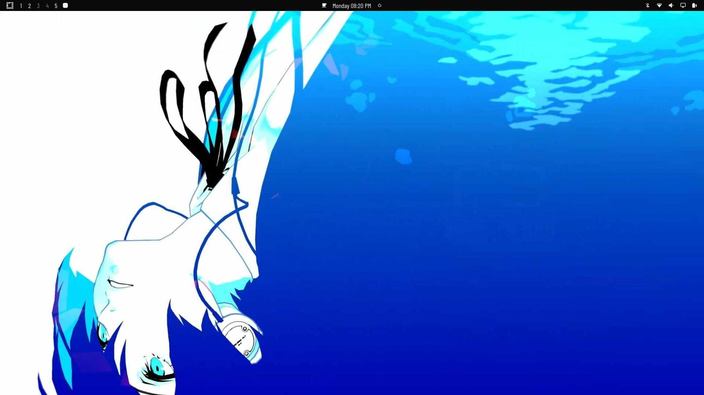
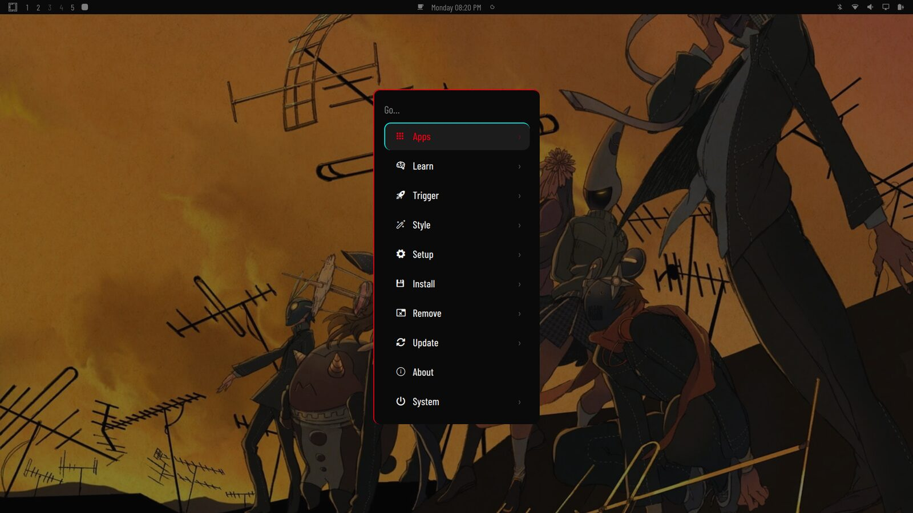
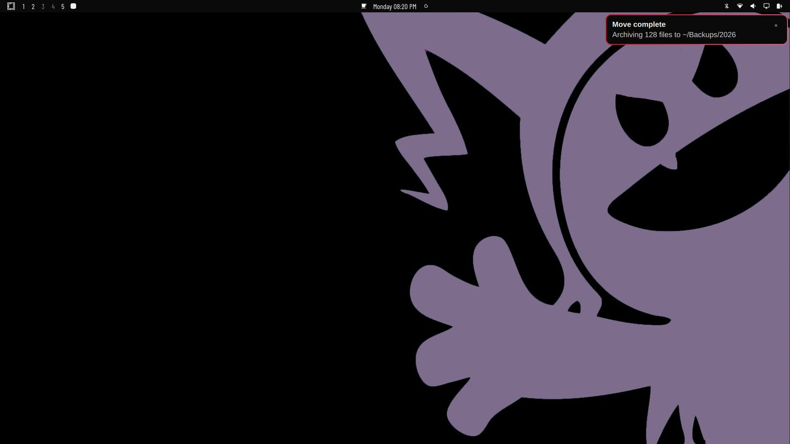

# persona-phantom-theme

A Persona 5 "Phantom Thieves" setup for [Omarchy](https://omarchy.org): a theme
(a Hyprland theme in the original sense), generated UI sound effects, and a
cloned menu plugin with sound design and a working Apps section.

> **Unofficial fan project.** Persona 5 and its characters are the property of
> ATLUS / SEGA. This repository is not affiliated with, endorsed by, or
> sponsored by them, and it contains no game assets. The wallpapers are
> third-party images credited in `theme/BACKGROUND-CREDITS.md`; everything
> else here is original and generated by the scripts in `sfx/`.

## What is in here

| Path | What it is |
|---|---|
| `theme/` | Colours, `hyprland.lua`, `neovim.lua`, `icons.theme`, shell control/font/launcher/lock/menu/popup TOML, preview |
| `theme/fonts/` | Barlow Condensed (SIL OFL 1.1) — the UI display face. The Omarchy shell styles every surface with a single `monospace` fontconfig alias, so one face controls the whole UI; this condensed grotesque is what makes it read as Persona |
| `plugins/menu/` | `dawar.menu` — the menu clone with SFX and a self-contained Apps section |
| `plugins/notifications/` | `dawar.notifications` — notification plugin, DND-aware sounds |
| `sfx/` | Generator scripts. The rendered `.wav` files are **not** committed — run `gen_sfx.py` to produce them (see below) |
| `bin/phantom-thieves-sounds` | Hyprland event → sound daemon |
| `config/phantom-thieves-sounds.conf` | Daemon toggles and volume |
| `systemd/` | User unit for the daemon |

Wallpapers are included but **are not ours and carry no license** — they came
from WallpaperFlare, an aggregator, and the original artists are unknown. See
`theme/BACKGROUND-CREDITS.md`, which credits the source and states plainly that
we hold no copyright. If you fork this, replace them: the original
procedurally generated wallpapers are reproducible from
`sfx/gen_phantom_thieves.py` and carry no such restriction.

## Screenshots







The bar typeset in Barlow Condensed, the theme's display face:


## Install

```sh
# theme
ln -s "$PWD/theme" ~/.config/omarchy/themes/phantom-thieves

# menu + notifications plugins
ln -s "$PWD/plugins/menu"      ~/.config/omarchy/plugins/dawar.menu
ln -s "$PWD/plugins/notifications" ~/.config/omarchy/plugins/dawar.notifications

# sounds — the .wav files are not committed, so render them.
# Needs numpy. Writes to ~/.local/share/omarchy/sounds/phantom-thieves.
# Set PHANTOM_SFX_OUT=/some/dir to render elsewhere.
(cd sfx && python3 gen_sfx.py)

# daemon
install -Dm755 bin/phantom-thieves-sounds ~/.local/bin/phantom-thieves-sounds
install -Dm644 config/phantom-thieves-sounds.conf ~/.config/phantom-thieves-sounds.conf
install -Dm644 systemd/phantom-thieves-sounds.service \
  ~/.config/systemd/user/phantom-thieves-sounds.service
systemctl --user enable --now phantom-thieves-sounds.service

# UI font — Barlow Condensed makes the bar/menu/notifications read as P5.
install -Dm644 theme/fonts/BarlowCondensed/*.ttf \
  ~/.local/share/fonts/phantom-thieves/
fc-cache -f >/dev/null
omarchy font set "Barlow Condensed"
```

Then enable the plugins and restart the shell:

```sh
omarchy-restart-shell
```

Both plugins are clones of first-party Omarchy plugins. They must keep a
`dawar.*` id: `PluginRegistry.qml` reserves the `omarchy.*` namespace, so a
third-party plugin cannot shadow `omarchy.menu` or `omarchy.notifications`.

Note the stock `omarchy-menu` command still points at the disabled first-party
plugin. Bind the shortcut to `dawar.menu` directly.

## Sound design

Every menu sound is a pool of three variants, picked at random but never
repeating the previous pick. Pure randomness still replays the same sample
back to back often enough to read as a glitch, and an open/close pair landing
on the same variant sounds like one sound with a dropout.

Four distinct sets, because they answer different questions:

| Set | Length | Answers |
|---|---|---|
| `menu-move-*` | 37 ms | "which row?" — short and dry so holding a key does not smear |
| `menu-enter-*` | 103 ms | "am I in now?" — longer, rising, wetter |
| `menu-back-*` | 93 ms | "leaving" — a soft fall, no upward motion |
| `menu-open-*` / `menu-close-*` | 144 ms | the menu appearing / disappearing |
| `window-open-*` / `window-close-*` | 200 ms | an app launching, with sub-octave weight |

Regenerate everything with:

```sh
cd sfx && python3 gen_sfx.py
```

Output is 48 kHz stereo 16-bit, peak `0.860`, no clipping, DC-blocked. The
generator draws only from a D-minor pitch table and avoids E5.

## Two upstream bugs this works around

Both were found by testing, not by reading code, and both failed *silently* —
which is what made them hard to see.

### 1. `shell.appLibrary` is null for third-party menu clones

`omarchy-menu.jsonc` declares `"apps": { "provider": "apps" }`, and the stock
provider reads rows from the shell's shared `AppLibrary`. That object is
injected into a scoped plugin shell as `shell.appLibrary`, and for a clone it
is permanently null — verified directly from a running menu:

```
pluginId=dawar.menu  ownSvc=yes  manifestKinds=["menu","bar-widget"]  appLibrary=NULL
```

The manifest and the "menu" kind are both correct, so this is an upstream
injection bug in `shell.qml`. Stock `omarchy.menu` is first-party and takes a
different path, which is why it is unaffected.

`plugins/menu/scripts/list-apps.sh` therefore enumerates desktop entries
directly, and `Menu.qml` falls back to it whenever `appLibrary` is absent. The
same null also broke *launching*, since activation was
`if (root.appLibrary) root.appLibrary.launch(...)` — it now falls back to
`uwsm-app -- gtk-launch <id>.desktop`.

A related trap: `Quickshell`'s `DesktopEntries.applications` fills
**asynchronously** (0 entries at t=0, 68 a few seconds later), so an empty
first read is not proof that there are no apps.

### 2. Two traps when spawning a helper from QML

Both produced empty output with no error, so they looked exactly like
"the script found nothing":

- `Qt.resolvedUrl(".")` returns a `file://` URL, and this Quickshell version
  has no `filePath` helper. Handing that URL to a spawned process fails
  silently. `pluginDir` strips the prefix and percent-decodes.
- `StdioCollector` needs `waitForEnd: true`, or its handler fires on the first
  chunk and truncates the result.

## Lessons worth keeping

- `if (!root.appLibrary) return` produces an *empty menu*, not an error. Any
  capability that can be null needs a log line when the fallback engages, or
  the next clone of this plugin hits the same wall invisibly.
- Do not strip instrumentation one line at a time. Removing a
  `property int appRowCount: -1` declaration while leaving a
  `root.appRowCount = ...` assignment behind throws at runtime in QML — not a
  no-op — and it aborted the function before it merged anything. Both symptoms
  (empty Apps section *and* search finding nothing) came from that one line.
- Verify playback, not just log lines. An early version of the daemon logged a
  cheerful `play menu-open-3` for every event while `pw-play` was exiting 1 on
  an unsupported `--stream-name` flag, with stderr sent to `/dev/null`. The
  sounds were silent for the whole time the log looked healthy.

## Development notes

- Synthetic key events (`wtype`, `xdotool`) do not reach the menu's QML
  `Keys.onPressed`, so navigation sounds have to be confirmed by ear.
- `keepLoaded: true` means QML edits need `omarchy-restart-shell`, not just
  `rescanPlugins`.
- `sfx/test_sfx_events.py` covers the Hyprland event parser: `python3
  sfx/test_sfx_events.py`.
